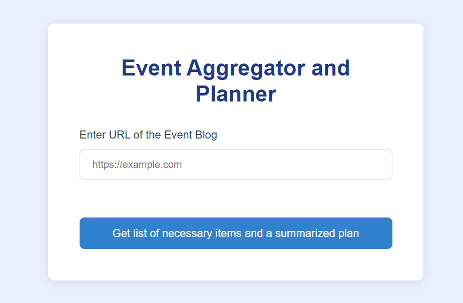
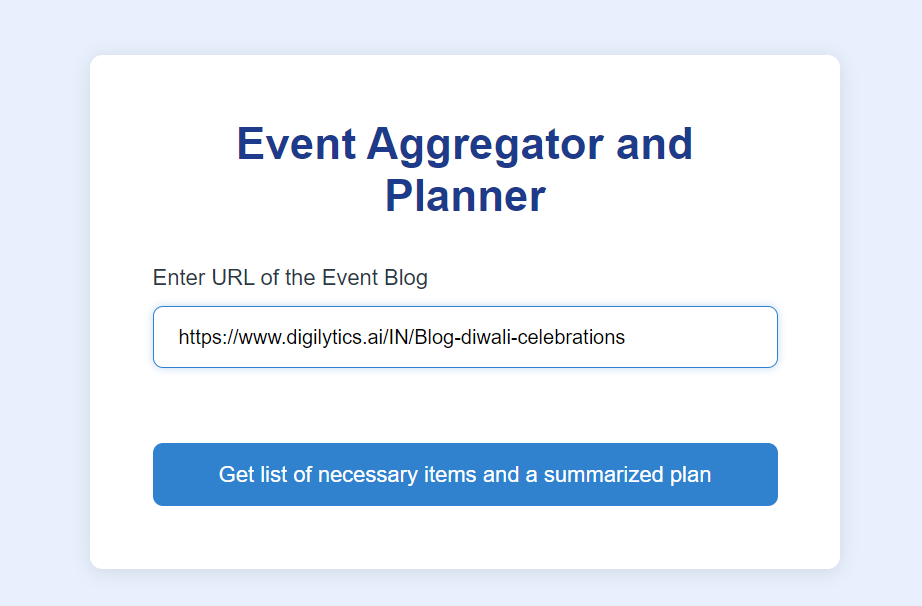
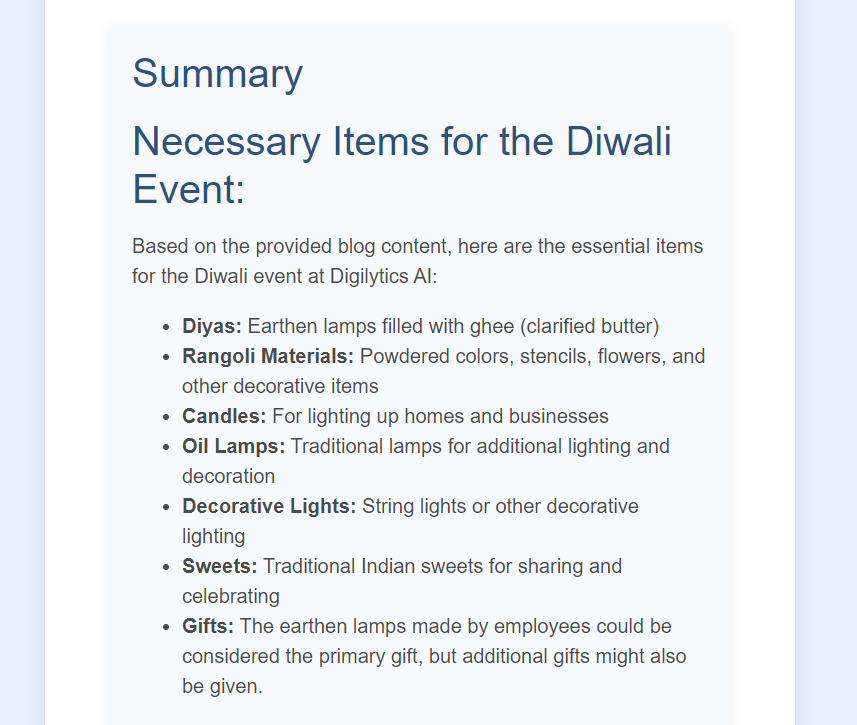
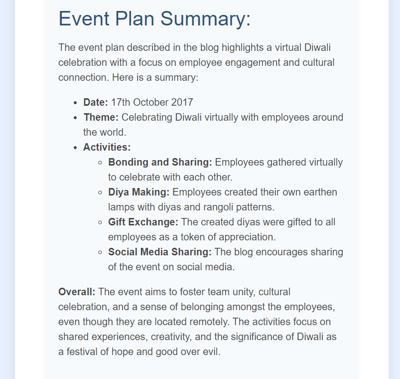

# Event Aggregator and Planner

This project is a web-based tool designed to help users plan events by scraping information from event-related blog web pages. The website utilizes the Firecrawl SDK to extract relevant content from the provided URL and employs the Gemini API to generate a list of necessary items and a summarized plan for the event based on the blog content. This tool assists users in quickly organizing their events with insights from various event blogs.

## Features

- **Scrape Event Blog Data**: Utilizes the Firecrawl SDK to extract relevant content from event blog URLs provided by the user.
- **Event Planning and Item Listing**: Uses the Gemini API to analyze the scraped content, generating a list of necessary items for the event and a summarized event plan.
- **User-Friendly Interface**: Provides a simple and intuitive interface for users to input event blog URLs and view the generated event plans.
- **Responsive Design**: The website design is fully responsive, ensuring a seamless experience on both desktop and mobile devices.

## Technologies Used

- **Firecrawl SDK**: For scraping event-related content from specified URLs.
- **Gemini API**: For analyzing the scraped content and generating lists of necessary items and summarized event plans.
- **Python**: The core programming language used for backend development and integrating Firecrawl and Gemini.
- **Flask**: A lightweight WSGI web application framework used to build the backend and serve the web pages.
- **HTML/CSS**: For frontend development, providing a modern and responsive user interface.

## How the Website Looks

Below are screenshots showing different parts of the website:

*Home page with input form for event blog URL.*

*Page showing the results after scraping and processing the event blog.*

*Generated list of necessary items and summarized event plan.*

